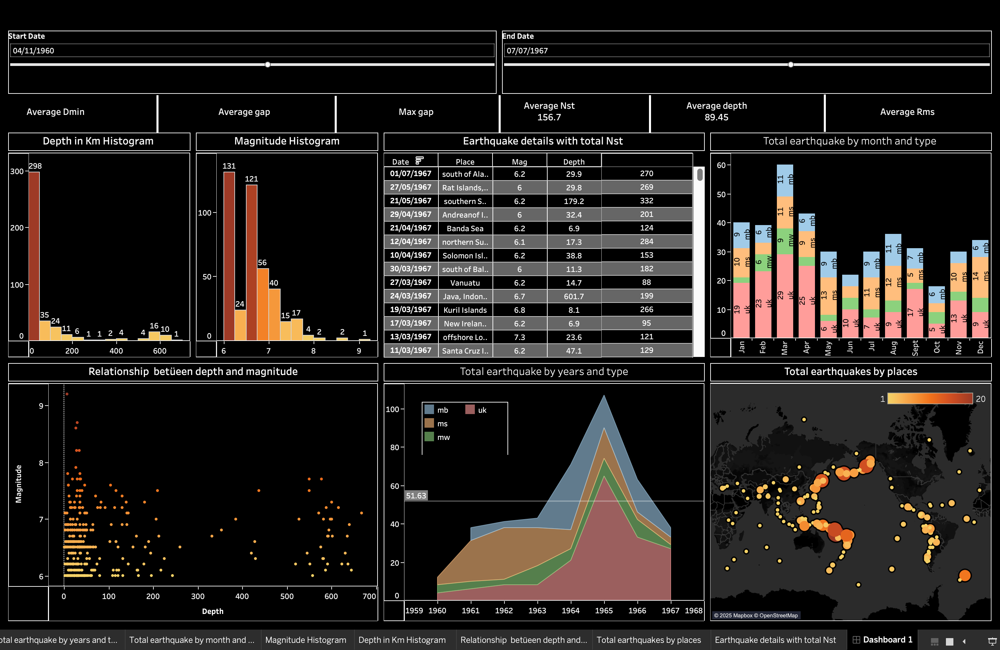

# Earthquake-Data-Visualization-Tableau
Interactive Tableau Dashboard for analyzing historical earthquake data, focusing on magnitude, depth, and time series trends.
# 🌎 Earthquake Data Analysis Dashboard

## Project Overview
This project presents an interactive dashboard, developed using **Tableau**, to analyze historical global earthquake data (Magnitude, Depth, Time Series). The main objective is to identify evolving trends and key correlations based on historical seismic events.

---

## 📸 Dashboard Preview
A visual representation of the project:

---

## 💡 Key Insights and Analysis

### 1. Correlation Between Depth and Magnitude
* **Analysis:** Visual inspection shows that depth and magnitude are not directly proportional. High-magnitude earthquakes can occur in both shallow and deep layers.
* **Insight:** The highest magnitude earthquakes (8.0+) are primarily concentrated in the **0-100 km depth range**, suggesting that higher energy is released in layers closer to the Earth's surface.

### 2. Time Series Trends (Frequency Over Time)
* **Analysis:** The overall number of earthquakes per year shows a **peak in the early 2000s**. This increase is mainly associated with a rise in the count of **`mb` and `ms`** type earthquakes.
* **Insight:** The sharp increase in recorded earthquakes since the 1980s is likely due to both **improved seismic registration technology** and potentially an increase in seismic activity.

### 3. Geographical Distribution (Global Hotspots)
* **Analysis:** The map visualization confirms that the vast majority of earthquakes are clustered around the **"Ring of Fire"**, specifically at the intersection points of tectonic plates surrounding the Pacific Ocean.
* **Insight:** Certain geographic regions (e.g., the coasts of Indonesia, Japan, and Chile) have a significantly higher earthquake risk compared to other areas.

### 4. Data Quality Metrics
* **Analysis:** Quality metrics displayed on the dashboard, such as **Average Dmin** (Horizontal distance from the epicenter to the nearest station) and **Average Rms** (Root-mean-square travel time residual), indicate that the underlying data set is of high accuracy.

---

## ⚙️ Technologies Used
* **Tableau Desktop:** Data visualization and dashboard design.
* **Data Source:** Historical Earthquake Data (Public Domain).
